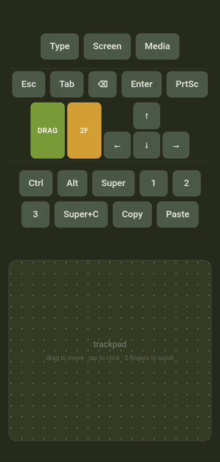

# hyprpad

Turn your phone into a mouse, keyboard and trackpad for a Wayland desktop
(Hyprland/Sway). Open a page in your phone's browser, no app to install on
either side.



- Trackpad: drag to move, tap to click, two fingers (or the `2F` hold-button)
  to scroll / right-click, `DRAG` hold-button for click-and-drag.
- Native keyboard capture: tap `Type` and type with your phone's own keyboard.
- Modifier keys, arrow keys (hold to repeat), Esc/Tab/Enter/Backspace/PrtSc.
- Configurable shortcut buttons (`SHORTCUTS` array in `hyprpad.py`) — add
  your own combo without touching layout. Copy/Paste and Super+C ship by default.
- Optional live screenshot of the desktop (`Screen`, via `grim`) so you can
  see where the cursor is.
- Voice: hold `Voice` to record, release to send the clip for local
  transcription (via [`faster-whisper`](https://github.com/SYSTRAN/faster-whisper),
  CPU, no cloud) — the text gets typed into whatever's focused, same as the
  native keyboard. Requires a secure browser context (see Requirements below)
  and is silently skipped if `faster-whisper` isn't installed.
- Media control panel (via `playerctl`/MPRIS): a `Media` button appears only
  while something's playing (Spotify, a YouTube tab, mpv, ...) and opens a
  panel with cover art, title/artist, transport controls and volume. If more
  than one player is active at once, a switcher lets you pick which to control.
- On [Omarchy](https://omarchy.org), the UI follows your active theme live
  (reads `~/.config/omarchy/current/theme/colors.toml`, cached until you
  switch themes). Elsewhere it falls back to a built-in Yerba Mate palette
  that follows time of day.
- Installable as a PWA (add to home screen) for a fullscreen, app-like feel.

## Install

```
curl -fsSL https://raw.githubusercontent.com/harbefas/hyprpad/main/install.sh | bash
```

Clones to `~/hyprpad` (override with `HYPRPAD_DIR`), installs dependencies
(`pacman` on Arch/Omarchy, `pip --user` elsewhere), sets up `/dev/uinput`
access, and installs+starts the systemd user service. Safe to re-run —
skips whatever's already done. Prints the URL to open on your phone when done.

If you were just added to the `input` group, log out and back in once —
the service will retry until that's picked up.

### Manual install

```
git clone https://github.com/harbefas/hyprpad.git && cd hyprpad
python3 hyprpad.py
```

Open `http://<this-machine-ip>:8123` on your phone, same network.

To keep it running (auto-starts on graphical login, restarts on crash):

```
mkdir -p ~/.config/systemd/user
cp systemd/hyprpad.service ~/.config/systemd/user/
systemctl --user daemon-reload
systemctl --user enable --now hyprpad.service
```

(Edit the `ExecStart`/`WorkingDirectory` paths in the unit if you cloned
this repo somewhere other than `~/hyprpad`.)

Env vars:
- `HYPRPAD_PORT` — default `8123`.
- `HYPRPAD_PASSWORD` — if set, requires login (cookie persists after).
- `HYPRPAD_TOKEN` — alternative to password, pass as `?t=<token>`.

## Requirements

`install.sh` handles all of this on Arch/Omarchy. For a manual install:

- Python 3.11+ (uses stdlib `tomllib`) + [`python-evdev`](https://python-evdev.readthedocs.io/)
- `grim` (optional, only for the live screen preview — wlroots compositors)
- `playerctl` (optional, only for the media control panel)
- [`faster-whisper`](https://github.com/SYSTRAN/faster-whisper) (optional, only
  for the `Voice` button): `pip install faster-whisper` (AUR:
  `python-faster-whisper`). First transcription downloads the model
  (~150MB) from Hugging Face.
- Mic access requires a [secure context](https://developer.mozilla.org/en-US/docs/Web/Security/Secure_Contexts):
  browsers block `getUserMedia` on a plain `http://<lan-ip>` origin. Either
  add the origin to Chrome's `chrome://flags/#unsafely-treat-insecure-origin-as-secure`
  allowlist on the phone, or put hyprpad behind HTTPS (e.g. a reverse proxy
  with a self-signed cert, or Tailscale Serve).
- Your user in the `input` group + a udev rule granting access to
  `/dev/uinput`:

  ```
  # /etc/udev/rules.d/99-uinput.rules
  KERNEL=="uinput", GROUP="input", MODE="0660"
  ```

  ```
  sudo usermod -aG input $USER
  sudo udevadm control --reload-rules && sudo udevadm trigger
  ```

  Log out/in (or reboot) for the group change to apply.

## Why

Existing phone-remote tools are mostly Windows-first or need a companion app
on both ends. This is a single Python file, browser-only, built on plain
`uinput` (works under any Wayland compositor, tested on Hyprland) — no
cloud, no account, no install beyond opening a URL.
